# PRAKTIKUM JARKOM MODUL 1 K 26 - 2026

## Angota Kelompok

| Nama                         | NRP        |
| ---------------------------- | ---------- |
| Az Zahra Fiddien Al Farabi          | 5027251114 |
| Muhammad Faturrahman | 5027241065 |

## Laporan

1. Untuk mempersiapkan pembangunan The Wired, Lain yang berperan sebagai Router membuat tiga Switch/Gateway: Switch 1 menuju dua Entitas yaitu Alice dan Mika, Switch 2 menuju Chisa, sedangkan Switch 3 menuju Knights dan Eiri. Kelima Entitas tersebut dikonfigurasi sebagai Client di GNS3. 

 

Skeme Pengalamatan IP

| Perangkat | Interface | Mode | IP Address | Netmask | Gateway | Fungsi |
| :--- | :--- | :--- | :--- | :--- | :--- | :--- |
| **Lain** | `eth0` | DHCP | Otomatis dari NAT | Sesuai NAT | Otomatis | WAN (Internet) |
| | `eth1` | Static | `192.224.1.1` | `255.255.255.0` | None | Gateway LAN 1 |
| | `eth2` | Static | `192.224.2.1` | `255.255.255.0` | None | Gateway LAN 2 |
| | `eth3` | Static | `192.224.3.1` | `255.255.255.0` | None | Gateway LAN 2 |
| **Alice** | `eth0` | Static | `192.224.1.2` | `255.255.255.0` | `192.224.1.1` | Host di Subnet 1 |
| **Mika** | `eth0` | Static | `192.224.1.3` | `255.255.255.0` | `192.224.1.1` | Host di Subnet 1 |
| **Chisa** | `eth0` | Static | `192.224.2.2` | `255.255.255.0` | `192.224.2.1` | Host di Subnet 2 |
| **Knights** | `eth0` | Static | `192.224.3.2` | `255.255.255.0` | `192.224.3.1` | Host di Subnet 3 |
| **Eiri** | `eth0` | Static | `192.224.3.3` | `255.255.255.0` | `192.224.3.1` | Host di Subnet 3 |


konfigurasi untuk Lain agar terhubung dengan setiap switch
```
auto eth1
iface eth1 inet static
  address 192.224.1.1
  netmask 255.255.255.0

auto eth2
iface eth2 inet static
  address 192.224.2.1
  netmask 255.255.255.0

auto eth3
iface eth3 inet static
  address 192.224.3.1
  netmask 255.255.255.0
```

konfigurasi untuk Alice

```
auto eth0
iface eth0 inet static
  address 192.224.1.2
  netmask 255.255.255.0
  gateway  192.224.1.1
```

konfigurasi untuk Mika
```
auto eth0
iface eth0 inet static
  address 192.224.1.3
  netmask 255.255.255.0
  gateway  192.224.1.1
```


konfigurasi untuk chisa
```
auto eth0
iface eth0 inet static
  address 192.224.2.3
  netmask 255.255.255.0
  gateway  192.224.2.1
```

konfigurasi untuk Knights
```
auto eth0
iface eth0 inet static
  address 192.224.3.2
  netmask 255.255.255.0
  gateway  192.224.3.1
```

konfigurasi untuk Eiri
```
auto eth0
iface eth0 inet static
  address 192.224.3.3
  netmask 255.255.255.0
  gateway  192.224.3.1
```


2. Karena menurut Lain pada saat itu The Wired masih terisolasi dari dunia luar, konfigurasikan router Lain agar dapat tersambung langsung ke jaringan internet publik melalui NAT/DHCP pada interface eth0.

konfigurrasi untuk lain ke NAT 

```
auto eth0
iface eth0 inet dhcp
```


3. Setelah router Lain terhubung ke internet, pastikan seluruh Entitas (Client) di bawah Switch 1, Switch 2, dan Switch 3 dapat saling terhubung dan berkomunikasi satu sama lain melalui konfigurasi routing. 

cek Alice ke chisa
```sh
ping 192.224.2.2
```


cek Alice ke Knights
```sh
ping 192.224.3.2
```


cek chisa ke knights

```sh
ping 192.224.3.2
```


4. Lain ingin agar setiap Entitas (Client) memiliki kemandirian di The Wired. Konfigurasikan firewall/iptables (NAT Masquerade) dan DNS resolver agar setiap Client dapat terhubung ke internet secara mandiri (dapat melakukan ping ke 8.8.8.8 dan membuka domain web google.com).

jalankan pada lain
```sh
echo nameserver 192.168.122.1 > /etc/resolv.conf
iptables -t nat -A POSTROUTING -o eth0 -j MASQUERADE
```


5. Eiri tetap berupaya menanamkan kekacauan ke dalam jaringan. Untuk mengantisipasi restart tiba-tiba, pastikan seluruh konfigurasi jaringan tidak hilang saat semua node di-restart. Buat script verifikasi di /root/cek_status.sh pada router Lain yang menampilkan ringkasan interface (ip -br a) dan status tabel NAT (iptables -t nat -L -v -n) setelah reboot.


Jalankan pada lain 
```sh
cat << 'EOF' > /root/cek_status.sh
#!/bin/bash

echo "===== STATUS INTERFACE ====="
ip -br a

echo
echo "===== STATUS NAT ====="
iptables -t nat -L -v -n
EOF
```

6. Mika mencurigai adanya anomali traffic pada segmen jaringannya. Jalankan generator traffic berikut (link file) pada node Mika, lalu lakukan packet sniffing menggunakan Wireshark pada interface node Mika. Terapkan display filter khusus untuk menyaring paket yang berprotokol DNS atau ICMP. Tunjukkan screenshot hasil filter beserta ringkasan paket yang lolos.

jalankan script 
```sh
./traffic_protocol7
```
Berikut hasil dari display filter 
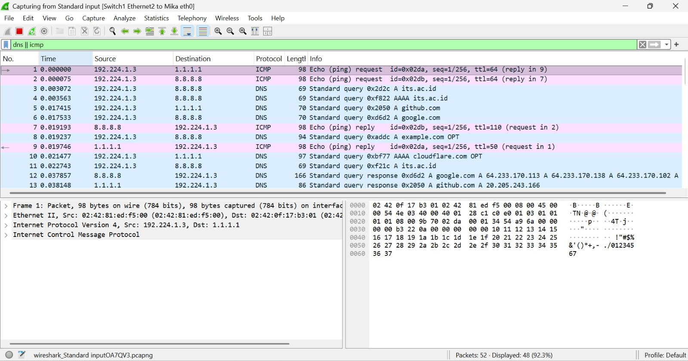
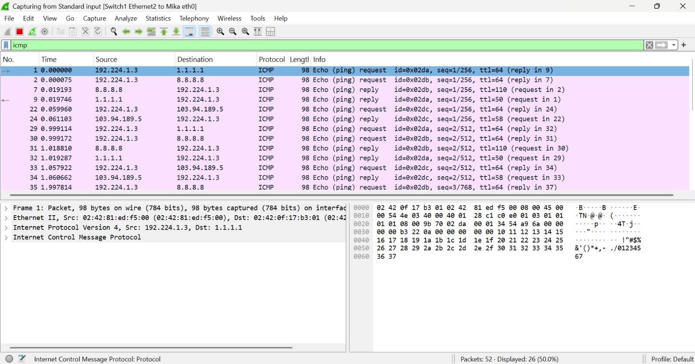


7. Chisa memutuskan mendirikan FTP Server pada node miliknya dengan shared folder di /var/wired/data. Terapkan kebijakan akses: user alice (hak akses read & write), user mika (dibatasi read-only), dan user eiri (dibatasi tanpa izin akses / blacklist). Buktikan konfigurasi dengan membuat file signal_alice.txt dari user alice, dan buktikan penolakan akses saat user eiri mencoba login.


pada chisa lakukan
```sh
apt install vsftpd -y
```

```sh
nano setup_ftp.sh
```

```sh
#!/bin/bash

echo "[*] Memulai Konfigurasi FTP Server pada Chisa..."

# 1. Buat folder shared
mkdir -p /var/wired/data

# 2. Buat user sistem jika belum ada
id -u alice &>/dev/null || useradd -d /var/wired/data -s /bin/bash alice
id -u mika &>/dev/null  || useradd -d /var/wired/data -s /bin/bash mika
id -u eiri &>/dev/null  || useradd -d /var/wired/data -s /bin/bash eiri

# Set password untuk masing-masing user
echo "alice:password123" | chpasswd
echo "mika:password123"  | chpasswd
echo "eiri:password123"  | chpasswd

# Set hak akses direktori shared
chown -R alice:alice /var/wired/data
chmod 775 /var/wired/data

# 3. Buat konfigurasi utama vsftpd (Sintaks Valid)
cat << 'EOF' > /etc/vsftpd.conf
listen=YES
listen_ipv6=NO
anonymous_enable=NO
local_enable=YES
write_enable=YES
local_umask=022

# Blacklist Eiri via userlist
userlist_enable=YES
userlist_file=/etc/vsftpd.user_list
userlist_deny=YES

# Per-user config untuk Mika (Read-Only)
user_config_dir=/etc/vsftpd_user_conf
EOF

# 4. Blacklist user Eiri
echo "eiri" > /etc/vsftpd.user_list

# 5. Konfigurasi Read-Only untuk user Mika
mkdir -p /etc/vsftpd_user_conf
echo "write_enable=NO" > /etc/vsftpd_user_conf/mika

# 6. Restart Layanan vsftpd khusus Docker (tanpa systemctl)
service vsftpd restart

echo "[+] Konfigurasi FTP Server Selesai!"
```

setelah menjelankan skrip lakukan
```
service vsftpd restart
service vsftpd status
```
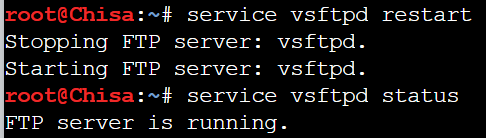


Mengecek bukti alice dapat melakukan write and read di chisa
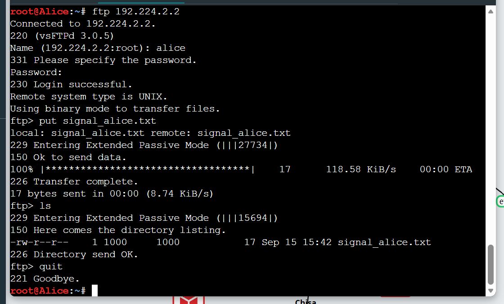

Mengecek bukti eire tidak dapat melakukan login
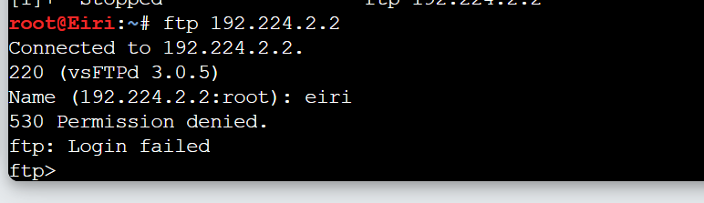

8. Kelompok rahasia Knights perlu mengirimkan dokumen laporan intelijen ke FTP Server Chisa. Lakukan koneksi FTP client dari node Knights ke FTP Server Chisa menggunakan akun alice. Upload file berikut (link file). Analisis sesi Wireshark dan sebutkan: perintah FTP untuk upload (STOR), kode status sukses server (226), dan port data TCP yang dinegosiasikan pada mode PASV.

pada knights

```sh
nano /root/intel_report.txt

Masukkan isi laporan:

==================================================
  KNIGHTS OF THE EASTERN CALCULUS — STATUS REPORT
  Protocol 7 Surveillance Network
  Classification: LEVEL 7 — EYES ONLY
==================================================

Date: [CLASSIFIED]
Agent: Knights Unit Alpha
Node: Switch 3 — Subnet 10.<PREFIX>.3.0/24

---

SUBJECT: Network Reconnaissance Report

The Wired has been successfully infiltrated through
Protocol 7 channels. Current observations:

1. Router "Lain" has been identified as the central
   gateway node connecting all three subnet segments.

2. Switch 1 (10.<PREFIX>.1.0/24) hosts Alice and Mika.
   Both nodes show standard traffic patterns.

3. Switch 2 (10.<PREFIX>.2.0/24) hosts Chisa alone.
   Isolated subnet — minimal cross-traffic observed.

4. Switch 3 (10.<PREFIX>.3.0/24) — our operational base.
   Knights and Eiri coexist on this segment.

RECOMMENDATION:
Continue monitoring FTP and Telnet sessions for
plaintext credential exposure. SSH tunnels remain
impenetrable without keylog access.

--- END OF REPORT ---

Knights of the Eastern Calculus
"Let's all love Lain."
```

lanjutkan connect ftp ke chisa dan lanjut dengan upload file ke chisa,dibarengi dengan menyalakan whireshark
```sh
ftp 192.224.2.2
passive
put /root/intel_report.txt
```
bukti knights telah melakukan upload file ke chisa dengan user alice
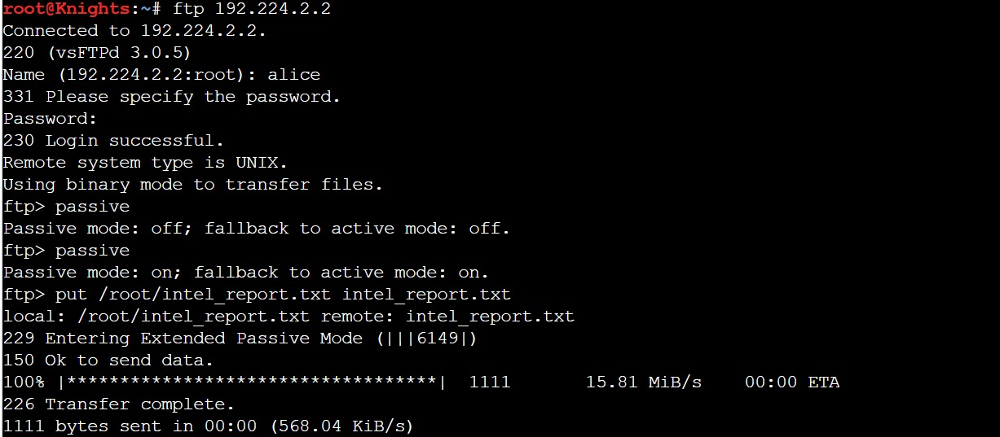

bukti hasil screenshot
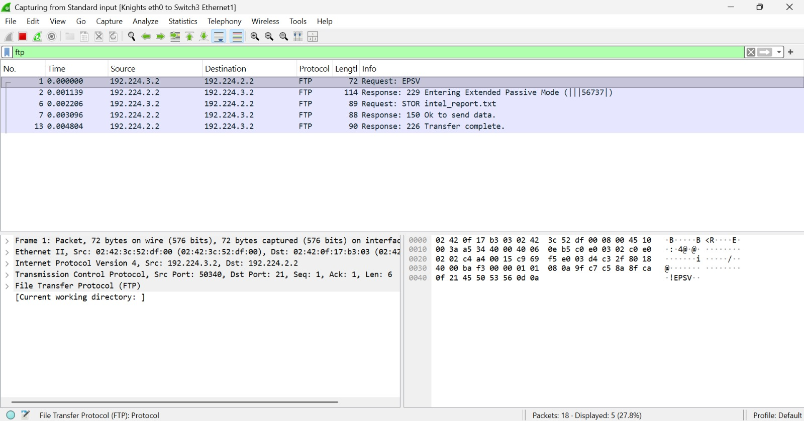

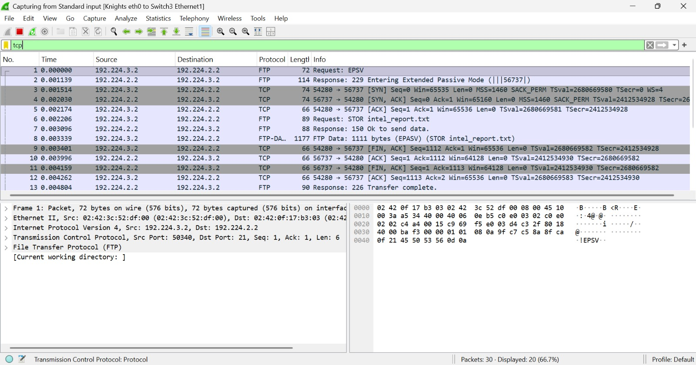


9. Mika mengakses dokumen Protokol Tujuh di (link file) dari FTP Server Chisa. Dari node Mika, unduh file tersebut menggunakan akun mika. Setelah itu, buktikan pembatasan read-only dengan mencoba mengunggah file baru dari akun mika, dan tunjukkan pesan error respon server (error 550 Permission denied) saat mika mencoba melakukan upload.


```sh
ftp 192.224.2.2
get protocol7_manifesto.zip
pur protocol7_manifesto.zip
```
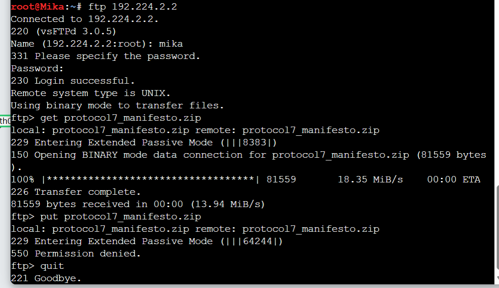


10. Knights melancarkan uji ketahanan koneksi ke server Chisa untuk menguji latensi jaringan The Wired. Kirimkan paket ping dari node Knights ke node Chisa dengan payload khusus 128 bytes dan interval 0.3 detik sebanyak 77 paket (ping -c 77 -s 128 -i 0.3 <IP_Chisa>). Buka Wireshark, catat nilai ICMP Type dan Code untuk Echo Request vs Echo Reply, serta analisis packet loss dan RTT (min/avg/max)

jalankan pada knights
```sh
ping -c 77 -s 128 -i 0.3 192.224.2.2
```

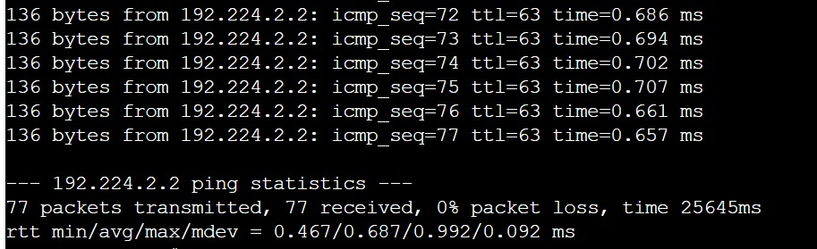

buka wireshark dan analsis paketnya
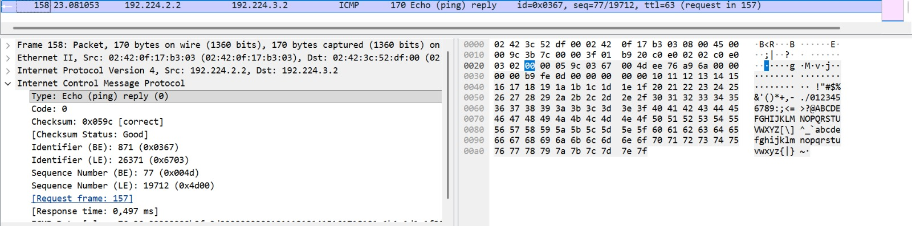
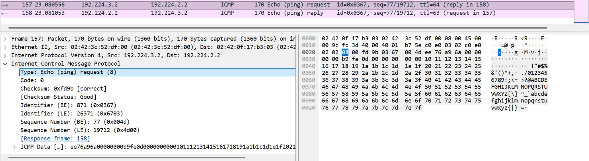

11. Buktikan kelemahan protokol Telnet dengan membuat akun phantom_user dan password wired_ghost pada layanan telnetd di node Chisa. Lakukan login Telnet dari node Eiri ke node Chisa dan tangkap sesi menggunakan Wireshark. Tunjukkan kredensial plain text melalui fitur Follow TCP Stream, serta jelaskan mengapa setiap karakter terkirim dalam paket TCP terpisah.

pada chisa buat akun phantom_user dengan password wired_ghost
```sh
useradd -m phantom_user
passwd phantom_user 
#masukkan wired_ghost (untuk password)
```
Jalankan wireshark pada eiri, Pada node Eiri lakukan telnet ke chisa dan masuk dengan phantom_user
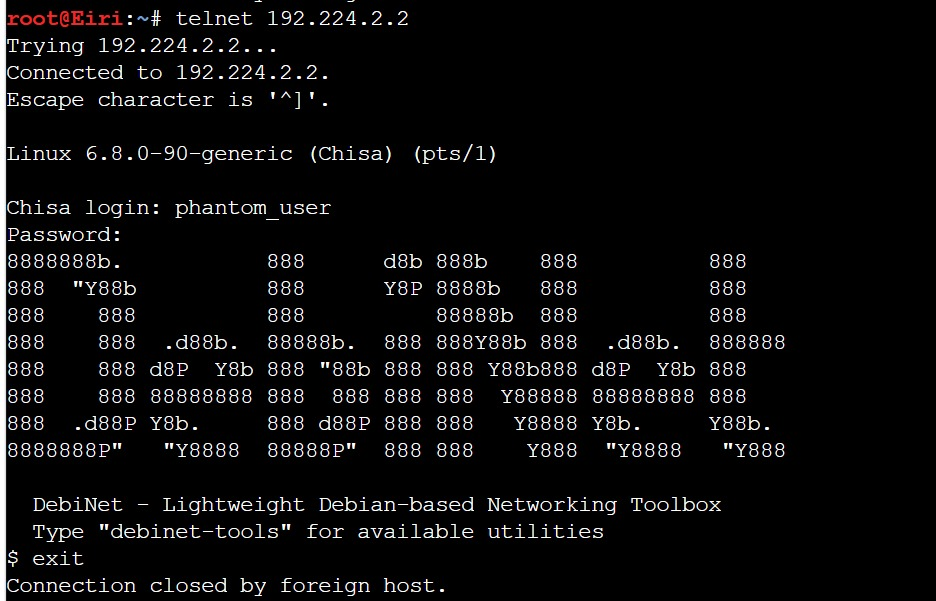

berikut plaint text pada paket telnet eiri dan chinsa
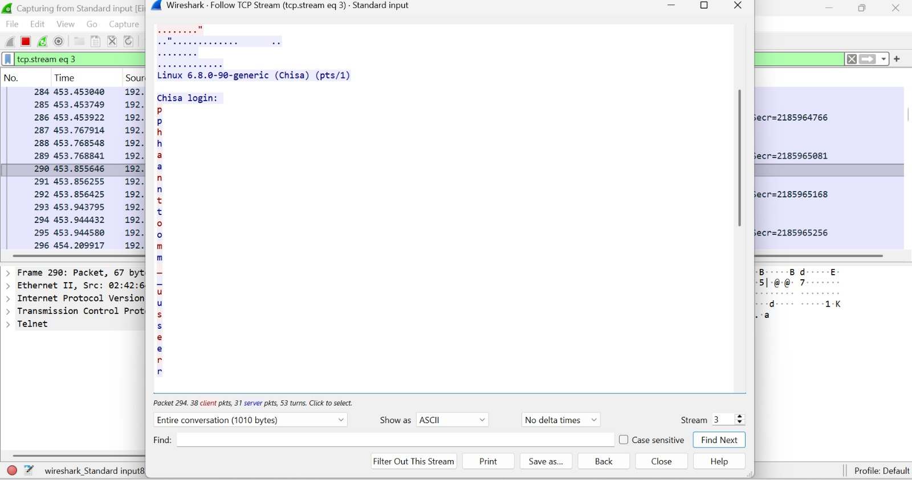
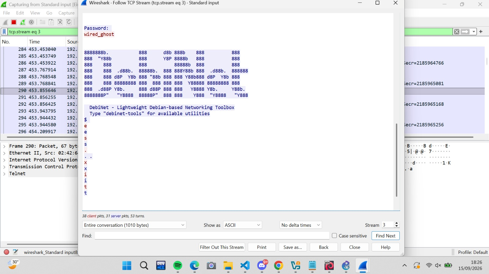

Pada telnet input pengguna langsung melalui TCP tanpa enkripsi, karena terminal bekerja secara interaktif dan input dikirim saat karakter diterima, karakter dapat muncul dalam segmen tcp yang terpisah. Akibatnya, packet capture dapat memperlihatkan aktivitas input secara plain text


12. Alice mencurigai Knights menjalankan beberapa layanan rahasia di node-nya. Lakukan pemindaian port dari node Alice ke node Knights menggunakan Netcat (nc) untuk memeriksa port 22 (SSH) dan 80 (HTTP) dalam keadaan terbuka, serta port rahasia 7777 dalam keadaan tertutup. Analisis di Wireshark perbedaan TCP Flag yang dikembalikan antara port terbuka (SYN-ACK) dengan port tertutup (RST-ACK).

lakukan open listiner pada knights port 22 dan port 80
```sh
nc -lknvp 22 &
nc -lknvp 80 &
```

lakukan capture wireshark lalu lakukan netcat ke kningts dari alice
```sh
nc -zv 192.224.3.2 22
nc -zv 192.224.3.2 80
nc -zv 192.224.3.2 7777
```
port terbuka 22
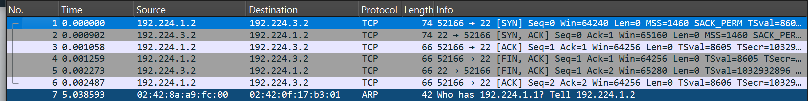
port terbuka 80
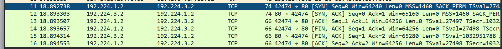
port tertutup 7777
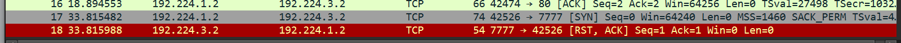

Pada port yang terbuka terjadi

[SYN, ACK] (Synchronize-Acknowledge)

Paket 1 & 11: Alice (192.224.1.2) mengirim [SYN] ke Knights (192.224.3.2).
Paket 2 & 12: Knights membalas dengan [SYN, ACK], menandakan port 22 dan 80 aktif dan siap membentuk koneksi.
Paket 3 & 13: Alice mengirim [ACK] — 3-Way Handshake berhasil diselesaikan.

pada port yang tertutup terjadi

[RST, ACK] (Reset-Acknowledge)

Paket 17: Alice mengirim [SYN] ke port 7777.
Paket 18: Knights langsung merespon dengan [RST, ACK] (baris merah), yang secara tegas memberi tahu Alice: "Port ini tidak melayani koneksi apapun, batalkan permintaan ini."

13. Lain memerintahkan agar administrasi jarak jauh menggunakan SSH secara aman tanpa password. Install OpenSSH server pada node Knights, buat pasangan kunci SSH (ssh-keygen) pada node Mika untuk user mika_admin, dan konfigurasikan public key authentication (PasswordAuthentication no). Lakukan koneksi SSH dari node Mika ke node Knights, tangkap sesi menggunakan Wireshark, identifikasi paket Protocol Version Exchange dan Key Exchange, serta jelaskan mengapa kredensial tidak terlihat dalam bentuk teks terbuka seperti pada Telnet

melakukan install pada knight dan jalankan server ssh
```sh
apt install openssh-server openssh-client -y
service ssh start
```

buat pasangan kunci ssh di mika dengan user mika_admin

```sh
Jalankan di mika
# 1. Buat user mika_admin di Mika jika belum ada
useradd -m -s /bin/bash mika_admin
echo "mika_admin:password123" | chpasswd

# 2. Masuk sebagai user mika_admin
su - mika_admin

# 3. Generate pasangan kunci SSH (tekan Enter untuk semua prompt default/tanpa passphrase)
ssh-keygen -t rsa -b 2048 -f ~/.ssh/id_rsa -N ""
```
buat user mika_admin di knight

```sh
jalankan di knights
# 1. Buat user mika_admin di Knights agar memiliki home directory
useradd -m -s /bin/bash mika_admin
echo "mika_admin:password123" | chpasswd

# 2. Buat folder .ssh untuk mika_admin di Knights
mkdir -p /home/mika_admin/.ssh
chmod 700 /home/mika_admin/.ssh
chown -R mika_admin:mika_admin /home/mika_admin/.ssh

```

```sh
echo "key ssh dari mika_admin" >> /home/mika_admin/.ssh/authorized_keys
chmod 600 /home/mika_admin/.ssh/authorized_keys
chown mika_admin:mika_admin /home/mika_admin/.ssh/authorized_keys
```

Jalankan wireshark untuk tangkap sesi ssh dari mika ke knights
```sh
ssh mika_admin@192.224.3.2
```
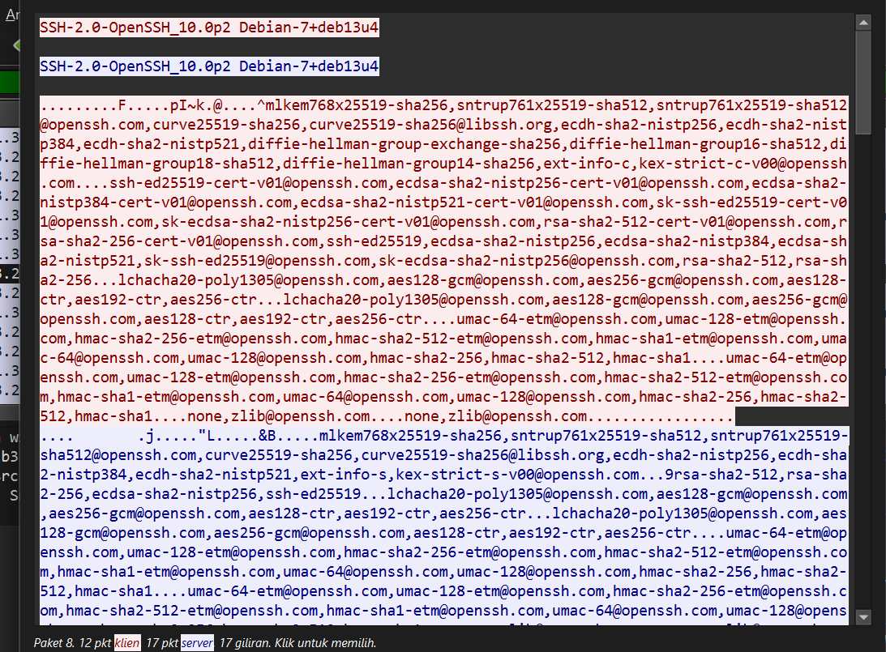

Enkripsi End-to-End: Setelah Key Exchange selesai, kedua pihak memiliki symmetric key yang sama. Semua paket berikutnya (termasuk verifikasi Public Key mika_admin) dikirim dalam bentuk Encrypted Packet.

Kerahasiaan Maju (Forward Secrecy): Penyadap di tengah jalan (seperti Wireshark) hanya bisa melihat aliran bytes acak. Tanpa memiliki private key atau session key yang disepakati saat KEX, Wireshark tidak bisa medekripsi isi pesan menjadi teks asli (plaintext) seperti pada protokol Telnet.

14. Setelah gagal mengakses FTP, Eiri melancarkan serangan brute-force terhadap form login web Alice. Analisis file capture wired_bruteforce.pcapng untuk mengidentifikasi alamat IP penyerang, target IP beserta port yang diserang, password user lain_admin yang berhasil ditembus, serta web server software dan versi yang dilaporkan pada response header. Validasi temuan kalian pada socket server:
(link file) nc [IP_Group] 3401 

Melakukan netcat ke nc 10.4.89.247 3401
```sh
nc 10.4.89.247 3401
```

What is the IP address of the attacker performing the brute force attack?
```sh
172.26.7.50
```

What is the target IP and port being attacked?
Format: IP:port

```sh
172.26.7.100:8080
```
What is the password found for the user lain_admin?
Format: string

Pada filter wireshark gunakan 
```sh
http.request.method == "POST" && http contains "name=lain_admin"
```
Maka jawabannya
```sh
wired_pr0tocol_7
```

What is the web server software and version reported in the response header?
Format: Software/X.X.X (e.g. Apache/2.4.0)

```sh
Apache/2.4.62
```

flag ditemukan
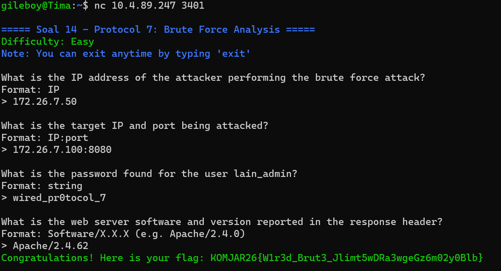


15. menyusup ke ruang server dan memasang perangkat keyboard USB berbahaya pada node Alice. Buka file capture wired_usb_hid.pcap, identifikasi Vendor ID dan Product ID perangkat USB dari deskriptor USB, alamat nomor device USB, serta pesan rahasia yang berhasil dicuri dari keystroke. Validasi temuan kalian pada socket server:
(link file) nc [IP_Group] 3402

lakukan pada filter 
```sh
usb.idVendor 

```
akan ditemukan idVendor:0x046d dan idproduct:0xc31c

What is the USB device address assigned to the keyboard?
Format: int

```sh
7
```

kita capture semua hex pada wireshark
```sh
tshark -r capture.pcap -Y "usb.capdata && usb.data_len == 8" -T fields -e usb.capdata > hex.txt
```
selanjutnya jalankan skrip 
```sh
#!/bin/bash

if [ -z "$1" ]; then
    echo "Penggunaan: $0 <file_hex.txt>"
    exit 1
fi

file_input="$1"

if [ ! -f "$file_input" ]; then
    echo "Error: File '$file_input' tidak ditemukan!"
    exit 1
fi

while IFS= read -r hex || [ -n "$hex" ]; do
    hex_clean=$(echo "$hex" | tr -d ':')
    
    # Ambil Modifier (byte 1) dan Keycode (byte 3)
    mod="${hex_clean:0:2}"
    byte="${hex_clean:4:2}"
    
    if [ -n "$byte" ] && [ "$byte" != "00" ]; then
        code=$((16#$byte))
        mod_code=$((16#$mod))
        
        # Cek apakah Shift aktif (Left Shift 0x02 atau Right Shift 0x20)
        is_shift=0
        if [ $((mod_code & 0x22)) -ne 0 ]; then
            is_shift=1
        fi

        if [ $code -ge 4 ] && [ $code -le 29 ]; then
            # Huruf a-z / A-Z
            if [ $is_shift -eq 1 ]; then
                printf "\\$(printf '%03o' $((code + 61)))"
            else
                printf "\\$(printf '%03o' $((code + 93)))"
            fi
        elif [ $code -ge 30 ] && [ $code -le 39 ]; then
            # Angka / Simbol atas angka
            if [ $is_shift -eq 1 ]; then
                case $code in
                    30) printf "!" ;; 31) printf "@" ;; 32) printf "#" ;;
                    33) printf "$" ;; 34) printf "%%" ;; 35) printf "^" ;;
                    36) printf "&" ;; 37) printf "*" ;; 38) printf "(" ;;
                    39) printf ")" ;;
                esac
            else
                if [ $code -eq 39 ]; then printf "0"; else printf "$((code - 29))"; fi
            fi
        else
            # Tombol Spesial Lainnya
            case $code in
                40) echo "" ;;          # Enter
                44) printf " " ;;       # Spasi
                45) [ $is_shift -eq 1 ] && printf "_" || printf "-" ;;
                46) [ $is_shift -eq 1 ] && printf "+" || printf "=" ;;
                47) [ $is_shift -eq 1 ] && printf "{" || printf "[" ;;
                48) [ $is_shift -eq 1 ] && printf "}" || printf "]" ;;
                51) [ $is_shift -eq 1 ] && printf ":" || printf ";" ;;
                52) [ $is_shift -eq 1 ] && printf '"' || printf "'" ;;
                54) [ $is_shift -eq 1 ] && printf "<" || printf "," ;;
                55) [ $is_shift -eq 1 ] && printf ">" || printf "." ;;
                56) [ $is_shift -eq 1 ] && printf "?" || printf "/" ;;
            esac
        fi
    fi
done < "$file_input"

echo ""
```

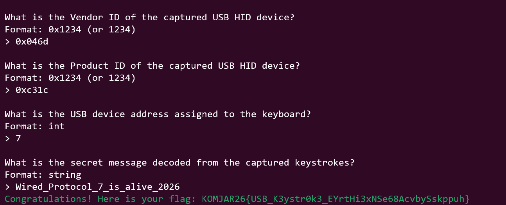


16. Eiri meletakkan file malware di server. Dari file capture wired_ftp_theft.pcap, lakukan analisis lalu lintas FTP untuk mengidentifikasi alamat IP server FTP penyerang, banner software FTP yang digunakan, kredensial login penyerang, serta ukuran (size in bytes) dari file malware knights_payload.exe yang diunduh. Validasi temuan kalian pada socket server:
	(link file) nc [IP_Group] 3403 

pada filter
```sh
ftp
```

setelah menemukan lalu lintas ftp, temukan packet yang berisi versi ftp lalu ikuti stream tcp
lalu akan ditemukan
```sh
ip penyerang 198.51.100.7
knights_agent:N4v1_s3cur3_2026
vsftpd 3.0.5
ukuran 524288
```
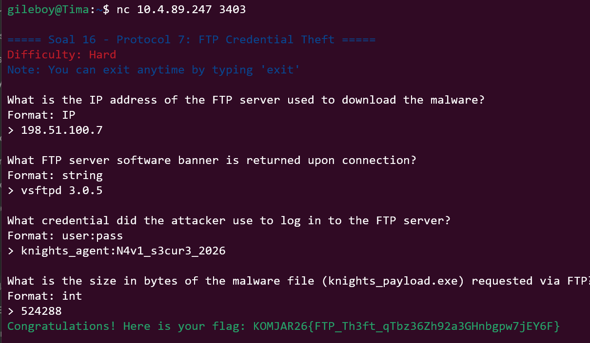

17. Alice membuat halaman web di node-nya. Eiri memanfaatkan celah untuk mengunduh payload berbahaya ke sistem Alice. Analisis file capture wired_http_c2.pcap untuk mengidentifikasi nama domain (Host) tempat malware diunduh, alamat IP server penyerang, nama file executable malware yang diunduh, serta kode status HTTP yang dikembalikan. Validasi temuan kalian pada socket server:
(link file) nc [IP_Group] 3404

temukan pcap yang mencurigakan setelah itu follow steam http
lalu akan ditemukan
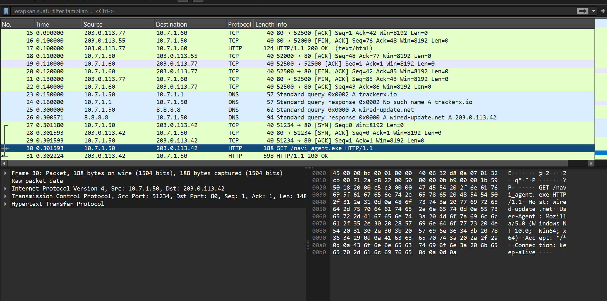
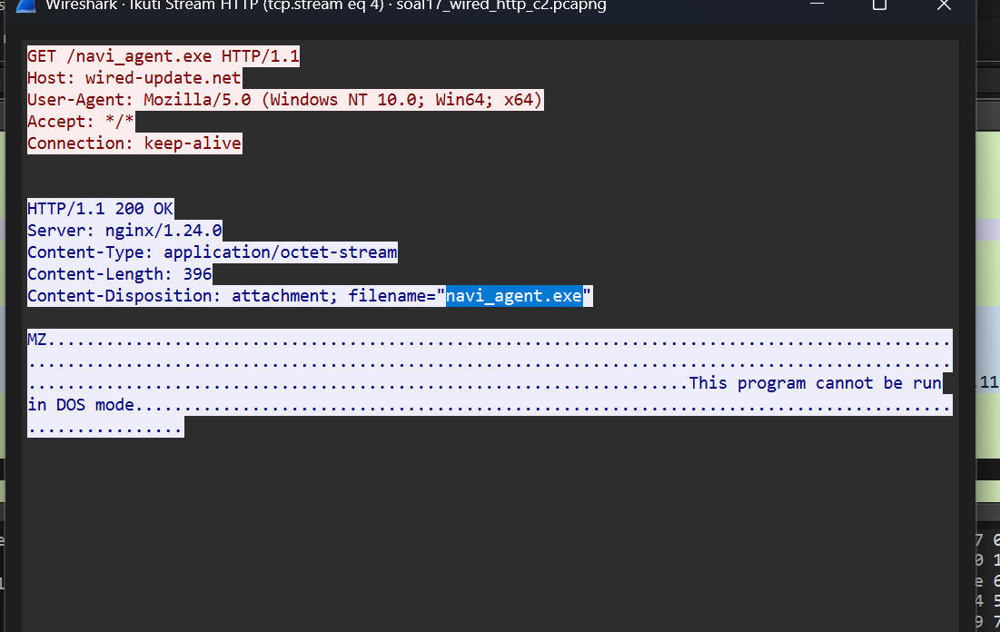
```sh
ip:203.0.113.42
host:wired-update.net
nama file:navi_agent.exe
status http:200
 ```
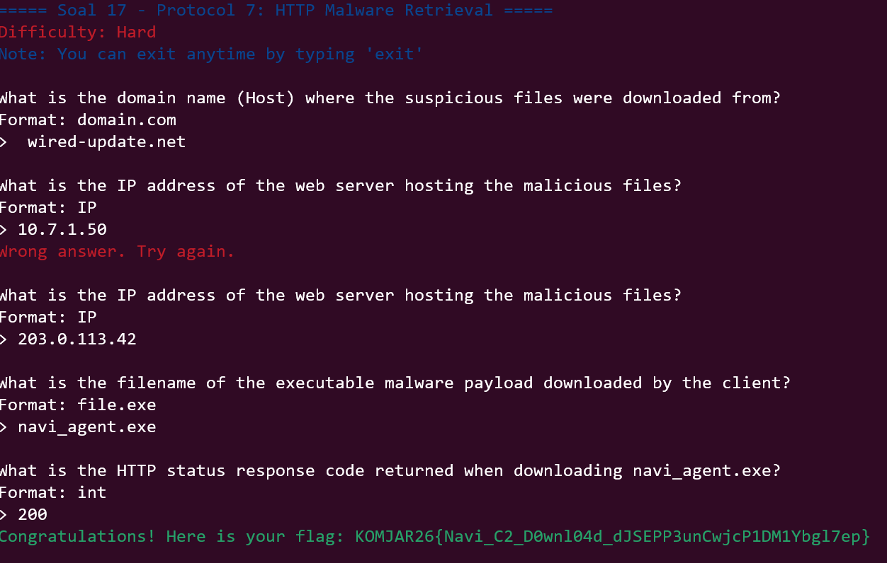

18. Eiri mengubah taktik penyerangan dengan menanamkan file malware menggunakan protokol file sharing SMB. Analisis file capture wired_smb_transfer.pcapng untuk mengidentifikasi nama protokol jaringan yang dieksploitasi, IP pengirim dan penerima, folder tujuan penyimpanan malware pada sistem korban, serta nama file executable malware yang ditransfer. Validasi temuan kalian pada socket server:
(link file) nc [IP_Group] 3405

temukan pcap yang mencurigakan setelah itu follow steam tcp
lalu akan ditemukan
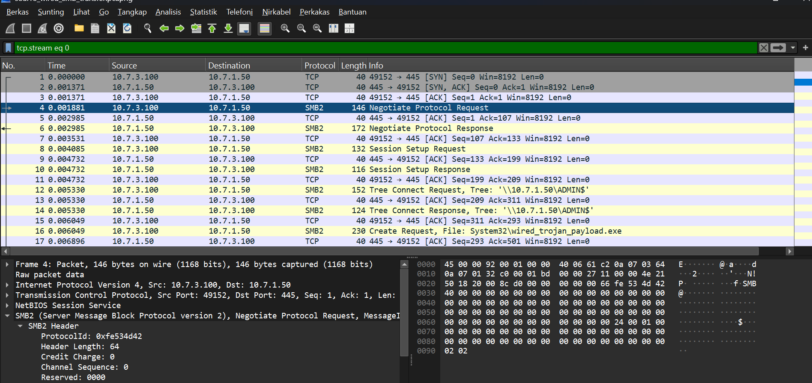
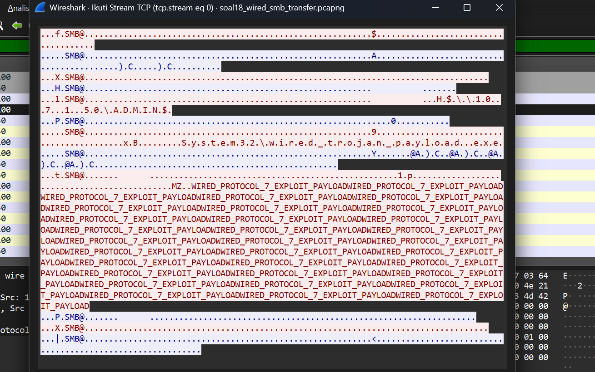
```sh
format Protocol: smb2
ip source:10.7.3.100
ip destionion:10.7.1.50
folder tujuan dan nama file :System32\wired_trojan_payload.exe
 ```
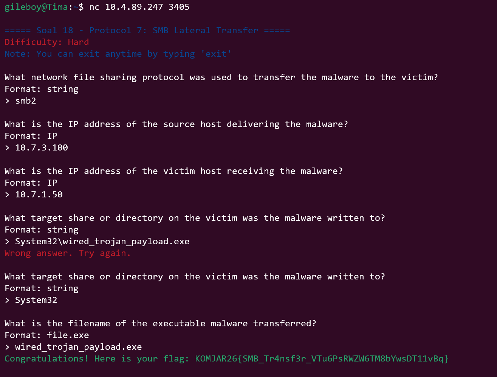


19. Eiri meneror jaringan dengan mengirimkan email pemerasan melalui protokol SMTP tanpa enkripsi. Analisis file capture wired_smtp_threat.pcap pada stream TCP terkait, identifikasi alamat email korban yang ditargetkan, password korban yang diklaim bocor oleh penyerang, jenis malware yang diinfeksikan, batas waktu (dalam hari) yang diberikan, serta MailClientID yang tercantum pada pesan. Validasi temuan kalian pada socket server:
	(link file) nc [IP_Group] 3406


temukan pcap yang mencurigakan setelah itu follow steam tcp
lalu akan ditemukan
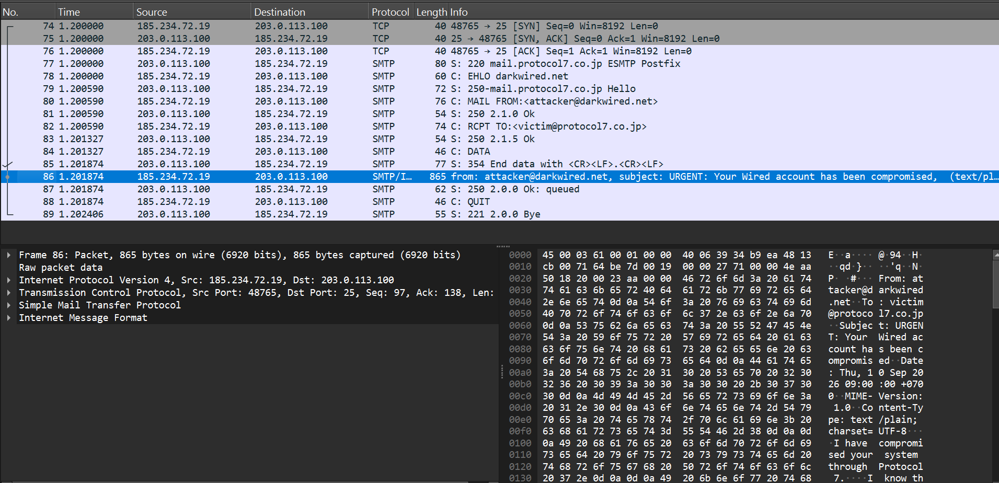
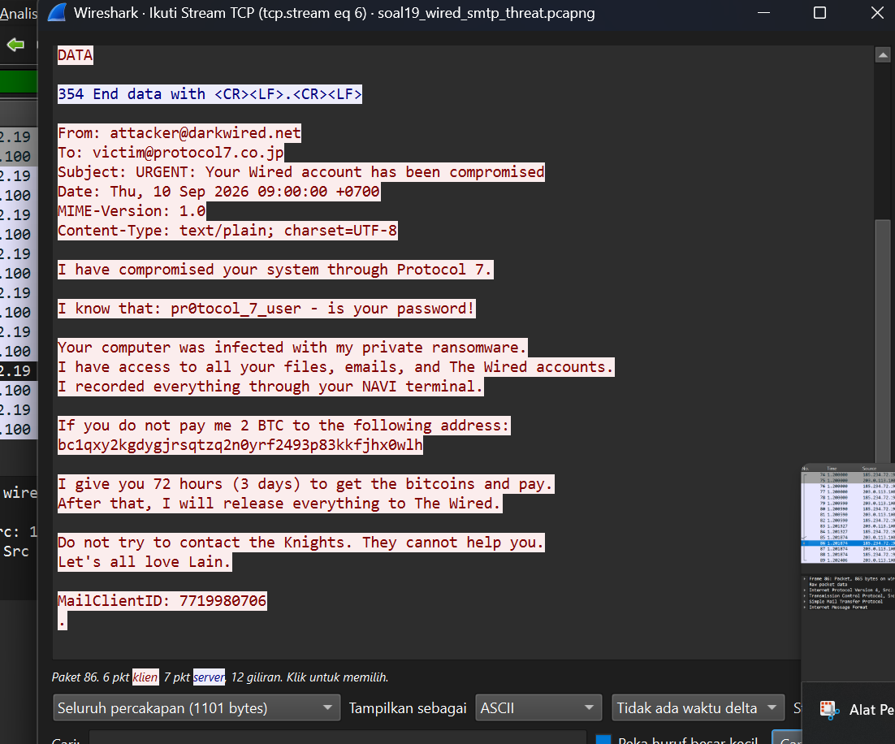
```sh
Alamat email target:victim@protocol7.co.jp
password target: pr0tocol_7_user
jenis_malware: ramsomware
batas waktu:3
MailClientID:7719980706
 ```
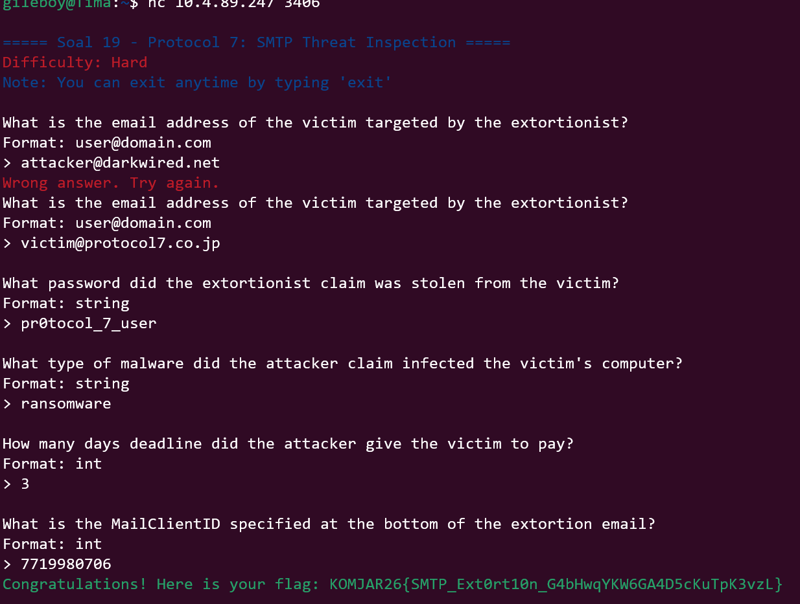

20. Untuk rencana pamungkasnya, Eiri menyembunyikan komunikasi malware di balik saluran terenkripsi TLS. Namun Alice telah menyediakan file keylog untuk mendekripsi lalu lintas data tersebut. Analisis file capture wired_tls_decrypt.pcapng bersama keyslogfile.txt untuk mengidentifikasi versi protokol TLS yang dinegosiasikan, nama domain (SNI) yang diakses, alamat IP server HTTPS penyerang, User-Agent yang digunakan, serta HTTP request method dan path yang tersembunyi di dalam sesi dekripsi. Validasi temuan kalian pada socket server: (link file) nc [IP_Group] 3407

karena masih terencrypt, buka menu Edit > Preferences, selanjutnya pilih protokol tls dan masukkan berkas keylognya maka akan tampil hasil decryptnya

Dari hasil packet langsung terlihat semua jawabannya, untuk lebih jelas pilih packet yang protocol http lalu ikuti stream http


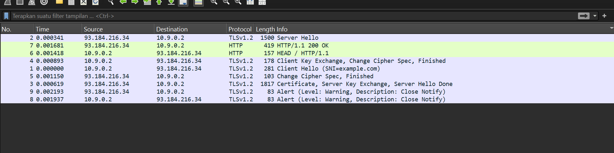
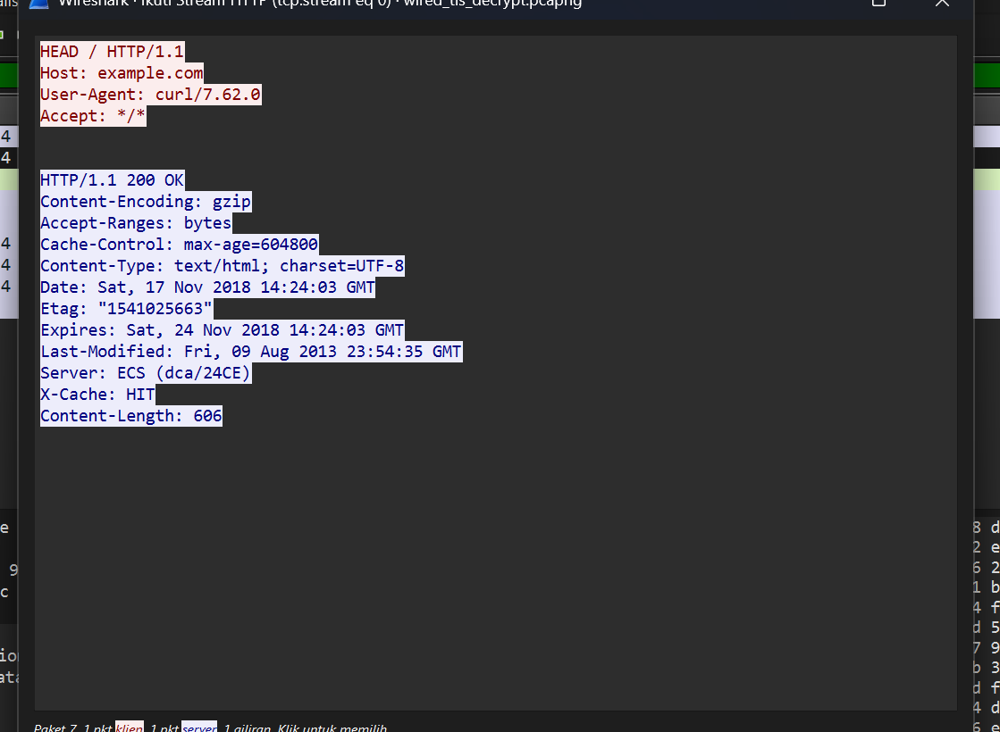
```sh
TLS protocol version: TLSv1.2

domain name (SNI / Host): example.com

ip address server penyerang : 93.184.216.34

user-Agent: curl/7.62.0

HTTP request method and path : HEAD / HTTP/1.1
```
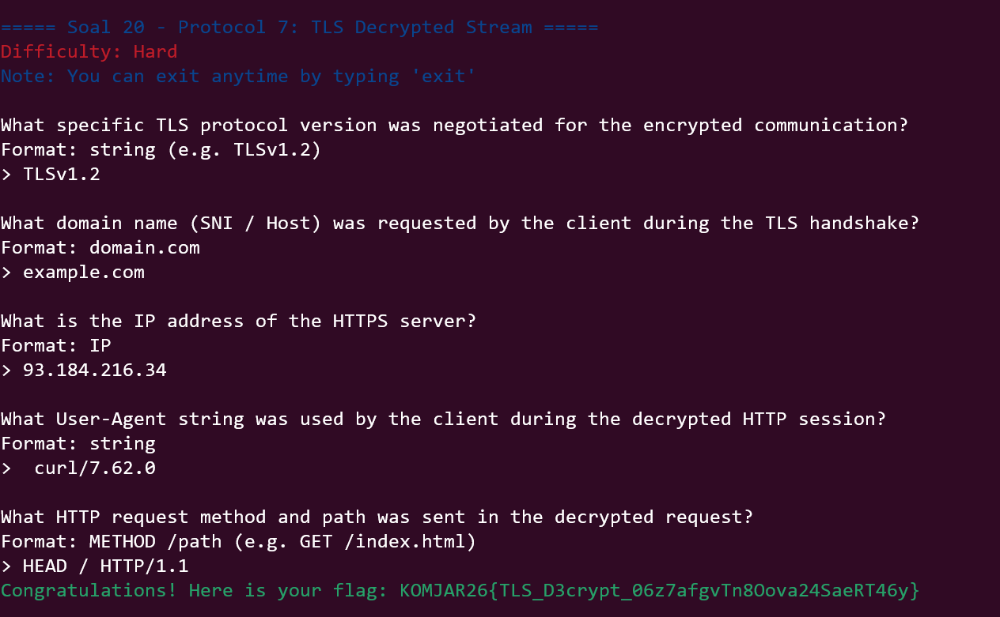
