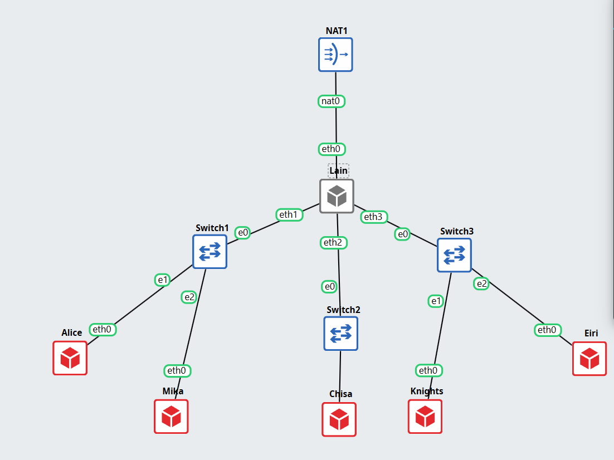
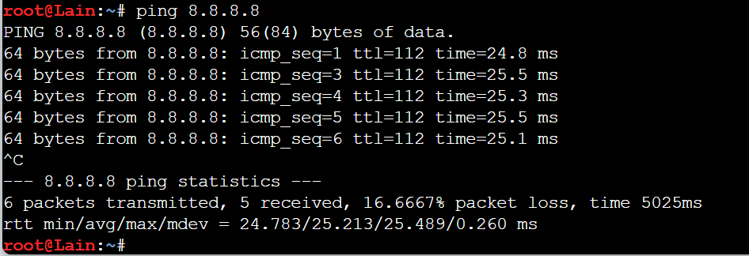
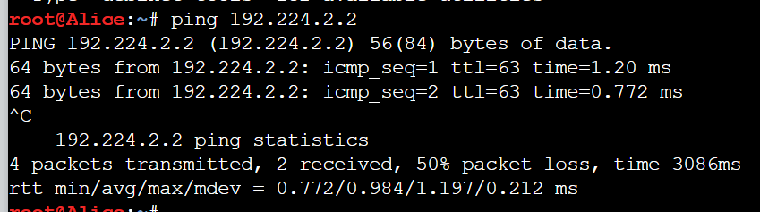
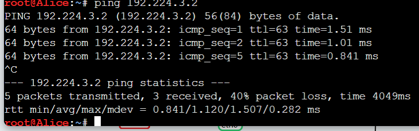
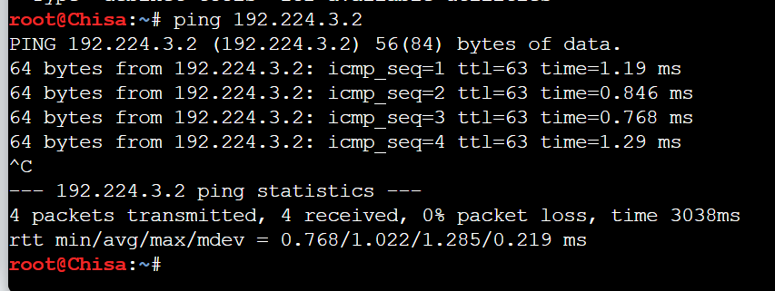
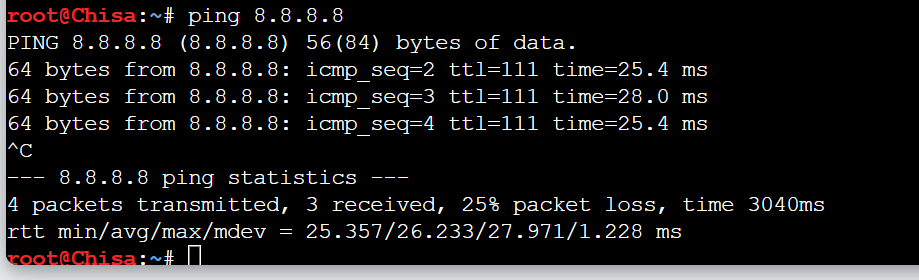

# PRAKTIKUM JARKOM MODUL 1 K 26 - 2026

## Angota Kelompok

| Nama                         | NRP        |
| ---------------------------- | ---------- |
| Az Zahra Fiddien Al Farabi          | 5027251114 |
| Muhammad Faturrahman | 5027241065 |

## Laporan

1. Untuk mempersiapkan pembangunan The Wired, Lain yang berperan sebagai Router membuat tiga Switch/Gateway: Switch 1 menuju dua Entitas yaitu Alice dan Mika, Switch 2 menuju Chisa, sedangkan Switch 3 menuju Knights dan Eiri. Kelima Entitas tersebut dikonfigurasi sebagai Client di GNS3. 

 

Skeme Pengalamatan IP

| Perangkat | Interface | Mode | IP Address | Netmask | Gateway | Fungsi |
| :--- | :--- | :--- | :--- | :--- | :--- | :--- |
| **Lain** | `eth0` | DHCP | Otomatis dari NAT | Sesuai NAT | Otomatis | WAN (Internet) |
| | `eth1` | Static | `192.224.1.1` | `255.255.255.0` | None | Gateway LAN 1 |
| | `eth2` | Static | `192.224.2.1` | `255.255.255.0` | None | Gateway LAN 2 |
| | `eth3` | Static | `192.224.3.1` | `255.255.255.0` | None | Gateway LAN 2 |
| **Alice** | `eth0` | Static | `192.224.1.2` | `255.255.255.0` | `192.224.1.1` | Host di Subnet 1 |
| **Mika** | `eth0` | Static | `192.224.1.3` | `255.255.255.0` | `192.224.1.1` | Host di Subnet 1 |
| **Chisa** | `eth0` | Static | `192.224.2.2` | `255.255.255.0` | `192.224.2.1` | Host di Subnet 2 |
| **Knights** | `eth0` | Static | `192.224.3.2` | `255.255.255.0` | `192.224.3.1` | Host di Subnet 3 |
| **Eiri** | `eth0` | Static | `192.224.3.3` | `255.255.255.0` | `192.224.3.1` | Host di Subnet 3 |


konfigurasi untuk Lain agar terhubung dengan setiap switch
```
auto eth1
iface eth1 inet static
  address 192.224.1.1
  netmask 255.255.255.0

auto eth2
iface eth2 inet static
  address 192.224.2.1
  netmask 255.255.255.0

auto eth3
iface eth3 inet static
  address 192.224.3.1
  netmask 255.255.255.0
```

konfigurasi untuk Alice

```
auto eth0
iface eth0 inet static
  address 192.224.1.2
  netmask 255.255.255.0
  gateway  192.224.1.1
```

konfigurasi untuk Mika
```
auto eth0
iface eth0 inet static
  address 192.224.1.3
  netmask 255.255.255.0
  gateway  192.224.1.1
```


konfigurasi untuk chisa
```
auto eth0
iface eth0 inet static
  address 192.224.2.3
  netmask 255.255.255.0
  gateway  192.224.2.1
```

konfigurasi untuk Knights
```
auto eth0
iface eth0 inet static
  address 192.224.3.2
  netmask 255.255.255.0
  gateway  192.224.3.1
```

konfigurasi untuk Eiri
```
auto eth0
iface eth0 inet static
  address 192.224.3.3
  netmask 255.255.255.0
  gateway  192.224.3.1
```


2. Karena menurut Lain pada saat itu The Wired masih terisolasi dari dunia luar, konfigurasikan router Lain agar dapat tersambung langsung ke jaringan internet publik melalui NAT/DHCP pada interface eth0.

konfigurrasi untuk lain ke NAT 

```
auto eth0
iface eth0 inet dhcp
```





3. Setelah router Lain terhubung ke internet, pastikan seluruh Entitas (Client) di bawah Switch 1, Switch 2, dan Switch 3 dapat saling terhubung dan berkomunikasi satu sama lain melalui konfigurasi routing. 

cek Alice ke chisa
```sh
ping 192.224.2.2
```


cek Alice ke Knights
```sh
ping 192.224.3.2
```


cek chisa ke knights

```sh
ping 192.224.3.2
```




4. Lain ingin agar setiap Entitas (Client) memiliki kemandirian di The Wired. Konfigurasikan firewall/iptables (NAT Masquerade) dan DNS resolver agar setiap Client dapat terhubung ke internet secara mandiri (dapat melakukan ping ke 8.8.8.8 dan membuka domain web google.com).

jalankan pada lain
```sh
echo nameserver 192.168.122.1 > /etc/resolv.conf
```


5. Eiri tetap berupaya menanamkan kekacauan ke dalam jaringan. Untuk mengantisipasi restart tiba-tiba, pastikan seluruh konfigurasi jaringan tidak hilang saat semua node di-restart. Buat script verifikasi di /root/cek_status.sh pada router Lain yang menampilkan ringkasan interface (ip -br a) dan status tabel NAT (iptables -t nat -L -v -n) setelah reboot.


Jalankan pada lain 
```sh
cat << 'EOF' > /root/cek_status.sh
#!/bin/bash

echo "===== STATUS INTERFACE ====="
ip -br a

echo
echo "===== STATUS NAT ====="
iptables -t nat -L -v -n
EOF
```

6. Mika mencurigai adanya anomali traffic pada segmen jaringannya. Jalankan generator traffic berikut (link file) pada node Mika, lalu lakukan packet sniffing menggunakan Wireshark pada interface node Mika. Terapkan display filter khusus untuk menyaring paket yang berprotokol DNS atau ICMP. Tunjukkan screenshot hasil filter beserta ringkasan paket yang lolos.

```

```

7. Chisa memutuskan mendirikan FTP Server pada node miliknya dengan shared folder di /var/wired/data. Terapkan kebijakan akses: user alice (hak akses read & write), user mika (dibatasi read-only), dan user eiri (dibatasi tanpa izin akses / blacklist). Buktikan konfigurasi dengan membuat file signal_alice.txt dari user alice, dan buktikan penolakan akses saat user eiri mencoba login.
```

```

8. Kelompok rahasia Knights perlu mengirimkan dokumen laporan intelijen ke FTP Server Chisa. Lakukan koneksi FTP client dari node Knights ke FTP Server Chisa menggunakan akun alice. Upload file berikut (link file). Analisis sesi Wireshark dan sebutkan: perintah FTP untuk upload (STOR), kode status sukses server (226), dan port data TCP yang dinegosiasikan pada mode PASV.


```

```
